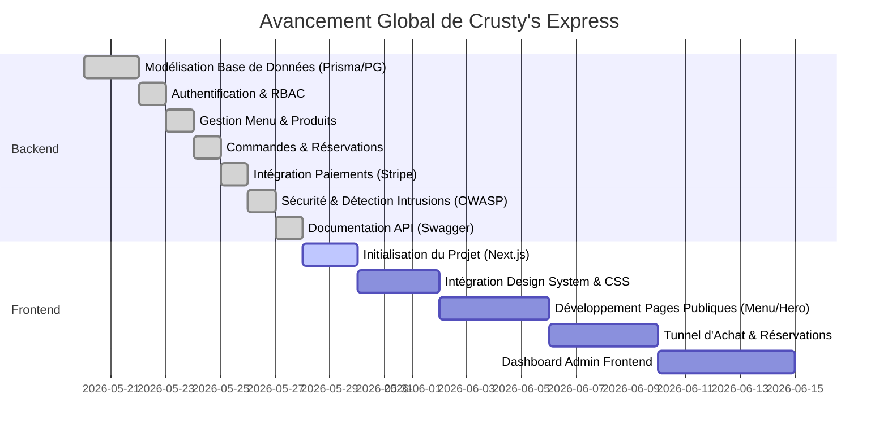

# Analyse d'Avancement du Projet — Crusty's Express

Ce document présente une analyse détaillée de l'avancement du projet **Crusty's Express** (plateforme premium de street food canadienne). Il dresse le bilan de ce qui a été réalisé, de ce qui reste à faire, ainsi que des recommandations techniques pour la suite.

---

## 📊 Résumé de l'Avancement

L'infrastructure technique globale du **Backend** est extrêmement robuste, hautement sécurisée, et **complète à près de 95%** sur le plan fonctionnel. En revanche, le **Frontend** (l'interface utilisateur visible) est **totalement inexistant** à ce stade.

---

## ✅ Réalisé (Ce qui est implémenté)

### 1. ⚙️ Cœur du Système & Architecture Backend (100% Réalisé)
* **Stack moderne & scalable** : Node.js, Express, TypeScript, Prisma ORM, et PostgreSQL.
* **Architecture modulaire haut de gamme** : Structure de dossiers organisée par modules isolés (chaque module intègre ses propres contrôleurs, routes, validation Zod, types, services, et fichiers de configuration).
* **Validation stricte** : Validation exhaustive de la configuration et des variables d'environnement au démarrage avec Zod (le serveur refuse de démarrer si une variable essentielle est invalide ou manquante).

### 2. 🗄️ Base de Données & Modélisation (100% Réalisé)
* Schéma Prisma PostgreSQL complet (`schema.prisma`) modélisant :
  * Les rôles et permissions (RBAC) pour les administrateurs et clients.
  * Les utilisateurs (`User` avec email, hash, tokens de session et récupération).
  * Le menu (`Category` et `Product` avec gestion des prix remisés, calories, images multiples).
  * Le tunnel de vente (`Order`, `OrderItem`, `Payment` avec multi-devises CAD, méthodes `CARD` / `CASH` / `STRIPE`).
  * Les réservations de tables (`Reservation` avec date, créneau horaire, nombre d'invités, statut).
  * Les outils marketing et communication (`Testimonial`, `Contact`, `Gallery`, `SiteContent`).
  * La journalisation d'activités, sessions d'uploads complexes, journaux de traitement multimédia.

### 3. 🔐 Sécurité & Hardening (95% Réalisé)
Un soin d'expert a été apporté à la sécurisation du backend (inspiré des recommandations OWASP) :
* **Détection active d'intrusions (OWASP Heuristic)** : Analyseur de requêtes suspectes interceptant les user-agents de scanners (comme *sqlmap*), les attaques d'injections SQL sur les paramètres d'URL, et les accès aux chemins pièges (Honeypot).
* **Réputation IP & Autoban** : Système accumulant des points d'infraction par IP avec bannissement automatique temporaire/permanent des adresses hostiles.
* **Fingerprinting Client** : Empreinte numérique SHA-256 générée par requête pour identifier précisément chaque client de façon unique.
* **Rate Limiting avancé** : Double rideau de limitation de débit (un limiteur global API à 100 req / 15 min / IP et un limiteur ciblé pour l'authentification).
* **Protections standards** : En-têtes sécurisés avec Helmet, protection HPP (Parameter Pollution), validation contre les injections XSS, et cryptage robuste des mots de passe (bcryptjs à 12 rounds).

### 4. 🛍️ Logique Métier & Modules API (95% Réalisé)
* **Auth Module** : Enregistrement, authentification sécurisée avec JWT double token (Access Token à durée courte + Refresh Token en cookie sécurisé HttpOnly), rotation des jetons, récupération de mot de passe.
* **Products & Categories Module** : Routes complètes pour lister, filtrer, et paginer les articles avec calculs de remises.
* **Orders Module** : Calcul des taxes canadiennes, déduction automatique des stocks à la commande, validation de l'état des produits, et restauration des stocks en cas d'annulation.
* **Payments Module** : Intégration de Stripe pour le traitement des paiements, gestion sécurisée des Webhooks Stripe pour mettre à jour automatiquement le statut des commandes (payé, échoué, remboursé), et remboursement intégré.
* **Reservations Module** : Système complet de validation de tables.
* **Uploads & Images Module** : Gestion de l'upload d'images de produits et bannières vers **Cloudinary** via Multer avec compression automatique à la volée avec la bibliothèque Sharp, gestion de versions d'images, et files d'attente de nettoyage.
* **Emails Asynchrones** : Traitement en arrière-plan des notifications d'emails (ex. confirmation de commande) via des files d'attente Redis / BullMQ, avec support de Mailtrap ou Resend.

### 5. 📖 Documentation & Tests (90% Réalisé)
* **Swagger premium** : Documentation Swagger interactive (`/api/docs`) habillée avec un thème sombre élégant et moderne de qualité professionnelle.
* **Tests unitaires et d'intégration** : Plus de 118 tests unitaires déjà écrits (Jest) vérifiant la logique des calculs de prix, des taxes, de la sécurité RBAC, des transitions d'états de commandes. Des mocks complets (Stripe, Cloudinary, Mail, Redis) sont en place pour des tests isolés et rapides.

---

## ❌ Non Réalisé (Ce qui reste à faire)

### 1. 🖥️ Le Frontend (0% Réalisé — Critique 🔴)
Il n'existe actuellement **aucun code frontend** dans l'espace de travail. C'est l'axe majeur à développer pour rendre le projet fonctionnel pour le grand public.
* **Recommandation** : Initialiser un projet **Next.js 14+ / React 19** avec **Tailwind CSS** et **Framer Motion** dans un dossier `frontend/` à la racine, comme préconisé dans l'architecture technique.
* **Fonctionnalités UI à implémenter** :
  * **Landing Page immersive** : Hero section street food premium avec micro-animations d'ambiance.
  * **Menu Dynamique** : Affichage responsive par catégorie, filtrage par tags, recherche en temps réel.
  * **Panier & Tunnel d'Achat** : Panier persistant localement, checkout avec formulaire d'adresse dynamique, intégration du Stripe Card Element pour la saisie sécurisée de carte de crédit.
  * **Module de Réservation** : Formulaire interactif avec sélection de la date et de l'heure et feedback instantané.
  * **Dashboard Admin** : Interface d'administration pour gérer le menu, suivre les commandes en direct (préparation, livraison), consulter les statistiques de ventes quotidiennes/mensuelles.

### 2. 🐛 Résolution de Bugs Mineurs Backend
* **Erreur de Test de Rate Limiting** : Un test unitaire (`Rate Limiter Middleware settings > should correctly determine which paths to skip limiters`) échoue actuellement car la fonction `skip` de `api-rate-limit.middleware.ts` tente de lire `req.headers['x-forwarded-for']` sans s'assurer que l'objet `req.headers` est défini, ce qui lève un `TypeError` dans l'environnement de test Jest.
* **Ajustement de la persistance de l'activité asynchrone** : Quelques open handles dans Jest ralentissent la fermeture du processus de test (liés aux instances Redis ou aux connexions Prisma non purgées dans certains fichiers de tests).

### 3. 🌐 Configuration de Production & Cloud
* Paramétrage des environnements réels sur Render/Railway (Staging) ou AWS/DigitalOcean (Production).
* Remplacement des clés secrètes mocks du `.env` par des clés de production Stripe et Cloudinary réelles.

---

## 🚀 Prochaines Étapes Recommandées

1. **Correction des détails du Backend (Priorité Basse)** : Modifier `req.headers['x-forwarded-for']` en `req.headers?.['x-forwarded-for']` pour réparer le test unitaire et s'assurer que toutes les suites de tests repassent au vert à 100%.
2. **Initialisation du Frontend Next.js (Priorité Haute ⭐️)** :
   * Créer la structure `frontend/` à la racine.
   * Configurer le design system avec les couleurs de la marque : Rouge profond, Jaune doré, Blanc, et Noir premium.
   * Développer la connexion avec l'API `/api/v1` du backend (authentification, profil utilisateur).
3. **Mise en place de l'Intégration Continue (CI/CD)** : Valider automatiquement les builds et tests Jest à chaque push de code.
